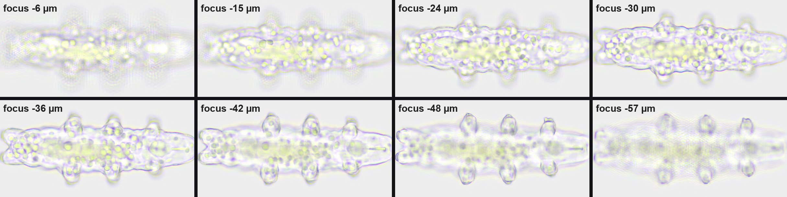
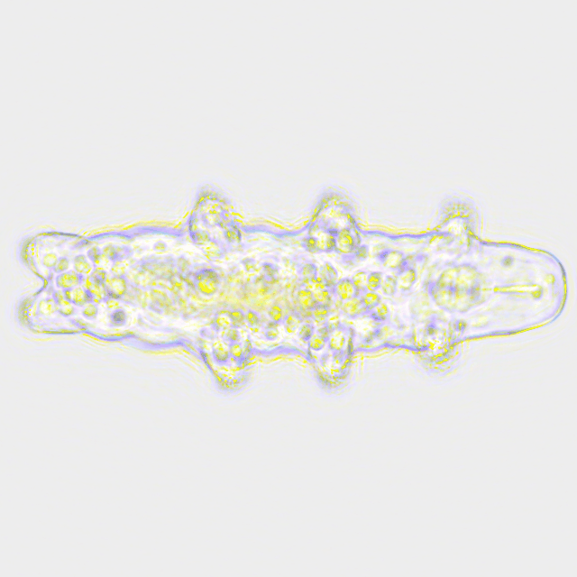
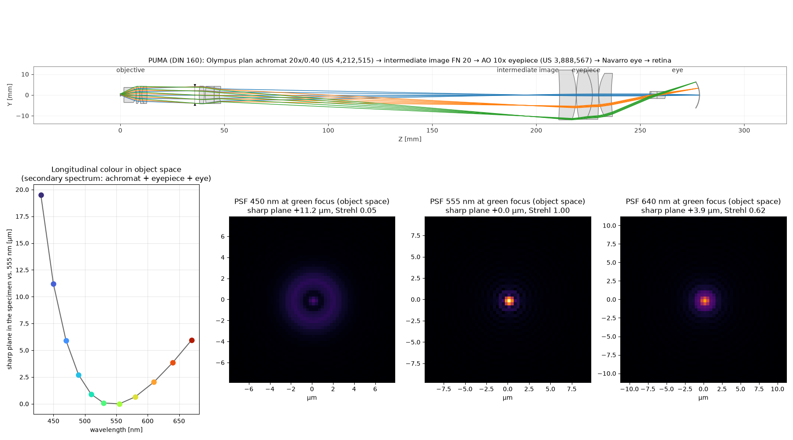

# PUMA Virtual Eyepiece

A physically computed view through the open-source **[PUMA microscope](https://github.com/TadPath/PUMA)** at a real, nanoCT-scanned tardigrade.

> **The PUMA microscope was invented and designed by Dr Paul J. Tadrous ([@TadPath](https://github.com/TadPath)).**
> All microscope hardware, CAD and documentation come from his project: **https://github.com/TadPath/PUMA** ([OptArc](https://www.optarc.co.uk/)).
> If you use or build on this work, please cite his paper: P. J. Tadrous, *"PUMA – An open-source 3D-printed direct vision microscope with augmented reality and spatial light modulator functions"*, Journal of Microscopy 283(3):259–280 (2021), https://doi.org/10.1111/jmi.13043

**Live viewer:** https://chillchamp1.github.io/puma-virtual-eyepiece/

The viewer lets you:
- focus through the animal;
- switch between the ray-traced PUMA optics and an ideal lens;
- rotate a 3D model of the microscope built from the original PUMA CAD parts.





None of the images are painted. White LED light is propagated as a wave through a 3D refractive-index volume of the animal. It is then imaged through lenses whose prescriptions come from open patents. Colour fringes, blur, diffraction and the depth-dependent spherical aberration all come out of that calculation.

This is an independent project built **on top of** PUMA. It is not part of the PUMA project and not endorsed by its author.

## What is simulated

```
LED 6500 K ─ Köhler condenser ─ tardigrade (nanoCT) ─ cover glass ─ 20x/0.40 plan achromat ─ DIN 160 tube ─ 10x eyepiece ─ eye ─ retina
```

| Part | Source | Status |
|---|---|---|
| Light source, tube length, field number, condenser NA range | PUMA documentation | open |
| Specimen | Gross et al. 2019, *H. exemplaris* nanoCT, 270 nm voxels, 11 segmented organs | open data (CC BY 4.0) |
| Tissue refractive indices, gut absorption | literature ranges | assumed |
| Objective | Olympus plan achromat 20x, US 4,212,515 (Itaya 1980), catalog glasses | patent, generic stand-in |
| Eyepiece | American Optical 10x, US 3,888,567 (Shoemaker 1975) | patent, generic stand-in |
| Eye | Navarro et al. 1985 schematic eye with ocular-media dispersion | literature |

PUMA specifies "any RMS 160 mm objective" and "any WF 10x/20 eyepiece". Real catalogue parts don't publish their lens data, so open patent designs of the same class are used. See [`optics/prescriptions_research.md`](optics/prescriptions_research.md) for all prescriptions and how they were checked.

## How it works

1. **Specimen** ([`sim/specimen.py`](sim/specimen.py)): nanoCT grey values and labels become a complex refractive-index volume with dispersion.
2. **Optics** ([`optics/system.py`](optics/system.py)): one sequential model from the object point in water to the retina, traced with [Optiland](https://github.com/optiland/optiland). Patent glasses (nd/vd) are mapped to the nearest Ohara/Schott catalog glass.
3. **Wavefront** ([`optics/opd.py`](optics/opd.py), [`optics/pupil.py`](optics/pupil.py)): for each wavelength, the plane in the specimen that is imaged sharply on the retina (longitudinal colour in object space) and the residual wavefront there. The wavefront is reconstructed from transverse ray aberrations (Hopkins' relation).
4. **Image formation** ([`sim/waveimage.py`](sim/waveimage.py)):
   - Abbe source-point integration (Köhler, 61 condenser points) × 9 wavelengths.
   - Multi-slice beam propagation through the animal, then exact angular-spectrum propagation to the sharp plane.
   - Pupil phase exp(i2πW/λ), and CIE 1931 colour to sRGB.
5. **Viewer** ([`docs/`](docs/)): the eyepiece view composites the simulated 207 µm patch into the 1 mm field of view.
6. **3D model** ([`cad/`](cad/)): PUMA FreeCAD files go through FreeCAD 0.20.2 (headless) to STL, then into Blender, where they are assembled by hand from the PUMA build guide and exported to glTF.

### Validation

| Check | Expected | This model |
|---|---|---|
| Objective magnification (paraxial) | −19.9x (patent) | −19.92x |
| Defocus per 1 µm focus-knob travel (ρ² term) | 0.080 µm (analytic) | 0.078 µm at the intermediate image, 0.081 µm at the retina |
| Defocus for an object 2 µm deeper in water | 0.120 µm (analytic) | 0.117 / 0.123 µm |
| Navarro eye focus | 16.404 mm (literature) | 16.405 mm |

Optiland's built-in wavefront analysis gave defocus and spherical terms 3–6× too large for this finite-conjugate, near-telecentric system. It was correct on simple test lenses. The ray geometry itself checks out, so the wavefront is reconstructed from the rays instead.

Result: blue (450 nm) comes to focus **11 µm deeper** than green, which is the secondary spectrum of an achromat. That is where the violet halos in the images come from.



### Limitations

- Aberrations are evaluated on axis. The simulated patch covers the central 20 % of the field, without field curvature towards the edge.
- Scalar wave optics, no polarisation.
- Tissue refractive indices are assumptions. No measured values exist for tardigrades.
- The scanned animal was critical-point dried, so it is shrunken (152 µm; living adults are 250–500 µm).
- The 3D assembly is approximate. The parts are original, their positions are placed by hand.
- The walking animation uses a plausible gait model, not motion-capture data.

## Illumination presets

The viewer has an illumination selector. Each preset needs its own focus stack (ray-traced optics + ideal lens):

| Preset | Condenser NA | Source points | Status | CPU time* | GPU time** |
|---|---|---|---|---|---|
| `mirror`: plane mirror, no condenser (PUMA Foundation scope) | ≈ 0.05 | 7 | **included** | ~10 min | 8 min |
| `k015`: Köhler, aperture stop closed | 0.15 | 37 | **included** | ~35 min | 8.5 min |
| `k030`: Köhler, standard | 0.30 | 61 | **included** | ~45 min | |
| `k040`: Köhler, fully open (= objective NA) | 0.40 | 91 | **included** | ~70 min | 11 min |

\*6-core laptop CPU, 21 focus planes × 9 wavelengths, both optics.
\*\*GTX 1080 + i7-7820HK. Only 1.5–4 min of this is wave optics; the rest is the CPU ray trace of the 21 traced pupils.

## Orientation: turning and rolling the animal

* **Turn in the field** (slider, ← →, or drag the image): the simulated optics are isoplanatic (one pupil
  for the whole field) and the condenser is rotationally symmetric, so turning the slide on the stage is
  exactly a rotation of the image. No extra computation.
* **Roll about the body axis** (30° steps: belly down, on its side, on its back): every roll is a full
  multi-slice computation of the rotated 3D volume, standard Köhler illumination, both optics.
  `python scripts/render_views.py` renders the missing rolls into `docs/img/views/` (3 min per roll on a
  GTX 1080 when traced and ideal optics are propagated separately; the script now lets both optics share
  one propagation through the animal, which should roughly halve that).

**Why not a faster linear 3D model?** In the weak-object (first Born / Rytov) approximation the focus
stack is a 3D filter of the refractive-index volume and any orientation would follow from one 3D FFT.
`sim/firstorder.py` implements it on the same source points and pupils, and `scripts/compare_firstorder.py`
compares it with multi-slice: Rytov is correct for a weak copy of the animal (Δn × 0.01: 12 % rms error
relative to the image contrast) but already fails at Δn × 0.05 (59 %). The real animal accumulates
~10 rad of phase and its cuticle has Δn ≈ 0.13, so multiple scattering matters and every view is
computed with multi-slice.

```bash
python scripts/fetch_data.py
python scripts/render_illumination.py                 # renders every preset not yet in docs/img/manifest.json
git add docs/img && git commit -m "Add illumination presets" && git push   # GitHub Pages updates itself
```

## Reproduce

```bash
pip install -r requirements.txt
python scripts/fetch_data.py                      # nanoCT (figshare) + PUMA FreeCAD files
cd sim
python render_color.py --out ../renders/traced --focus=-30,-36,-42 --rings 4 --nlam 9 --pupil traced
python render_color.py --out ../renders/ideal  --focus=-30,-36,-42 --rings 4 --nlam 9 --pupil ideal
python eyepiece_view.py ../renders/traced ../docs/img/traced
```

A full 21-plane focus stack takes about 20 min on a 6-core laptop CPU.

**NVIDIA GPU (optional, much faster):** the wave-optics engine switches to CuPy/cuFFT automatically when CuPy and a CUDA device are found (`PUMA_BACKEND=cpu|gpu|auto`).

```bash
pip install cupy-cuda12x          # or cupy-cuda11x, matching your CUDA driver
python scripts/check_gpu.py       # renders one test image on CPU and GPU, compares them, prints the speed-up
```

To rebuild the 3D model you need FreeCAD 0.20.2 (the PUMA files can break when recomputed in FreeCAD 1.x) and Blender 5.x. Run these in order: `cad/fc_toplevel.py` (with FreeCADCmd), `cad/name_parts.py`, `cad/assemble_puma.py` and `cad/export_glb.py` (with Blender).

## Credits and licences

- **PUMA microscope**: invented and designed by Dr Paul J. Tadrous ([@TadPath](https://github.com/TadPath)), https://github.com/TadPath/PUMA. Paper: J. Microsc. 283(3):259–280 (2021), https://doi.org/10.1111/jmi.13043. The CAD is GPL-3.0 and the documentation GFDL-1.3. The 3D model in `docs/model/` is derived from the PUMA CAD and distributed under GPL-3.0.
- **Tardigrade nanoCT**: Gross V., Müller M., Hehn L., Ferstl S., Allner S., Dierolf M., Achterhold K., Mayer G., Pfeiffer F. (2019). *X-ray imaging of a water bear offers a new look at tardigrade internal anatomy.* Zoological Letters 5:14, https://doi.org/10.1186/s40851-019-0130-6. Licensed CC BY 4.0. The simulated images contain data derived from this scan and are shared under CC BY 4.0 with this attribution. The raw data are not redistributed here; `scripts/fetch_data.py` downloads them.
- **Optical designs**: US 4,212,515 (Olympus), US 3,888,567 (American Optical). The patents have expired, so the designs are public.
- **Eye model**: Navarro R., Santamaría J., Bescós J. (1985), JOSA A 2(8):1273.
- **Software**: Optiland (MIT), NumPy/SciPy, Blender, FreeCAD, model-viewer (Apache-2.0).

The code in this repository is licensed under **GPL-3.0-or-later** (see [LICENSE](LICENSE)).

This was built as an experiment in AI-assisted scientific visualisation, with Claude (Anthropic).
